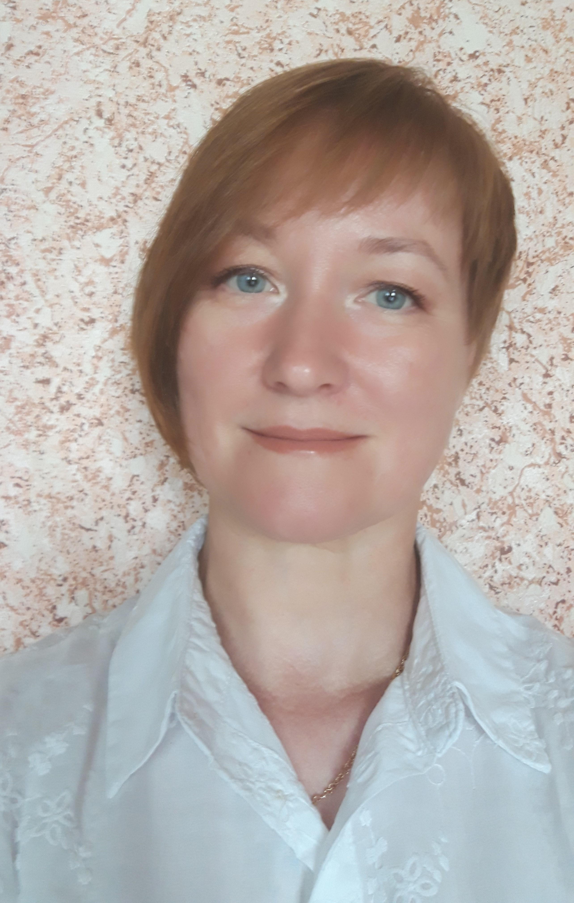

## Здравствуйте!
## Меня зовут Юлия Абрамова и я биолог.

Я работаю в бактериологической лаборатории, выявляю и изучаю  микроорганизмы, которые способны вызывать заболевания у людей.

1. Провожу бактериологические исследования;
2. Осуществляю мероприятия по контролю за качеством проводимых исследований;
3. Осваиваю и внедряю новые методы бактериологических исследований;
   
======================================================
    
 А ещё, я студент Нетологии и осваиваю профессию Веб-разработчика.

 Я родилась и живу на крупнейшем острове России. Это остров Сахалин, который расположен в Тихом океане. Своей формой остров напоминает рыбу. 

 *В настоящее время моя жизнь тесно связана с Санкт-Петербургом и я часто бываю в этом историческом городе.*